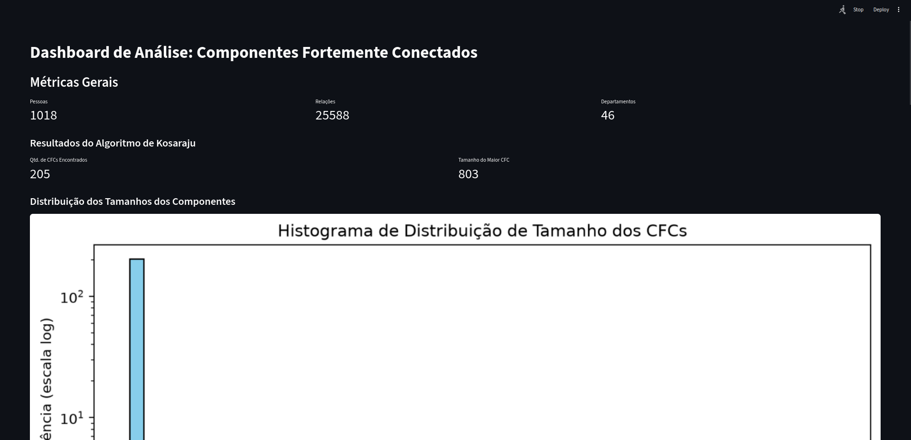
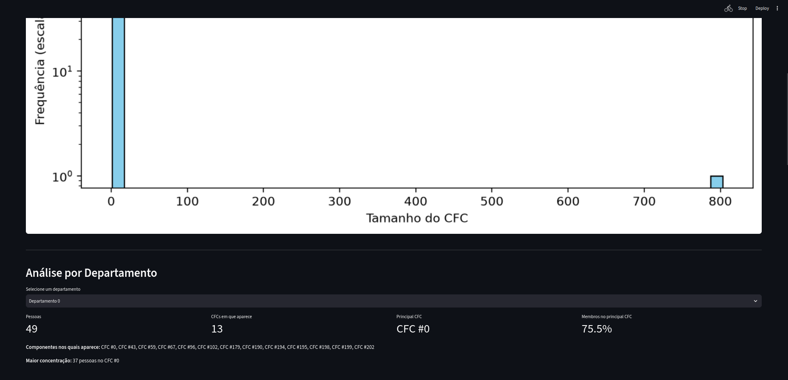
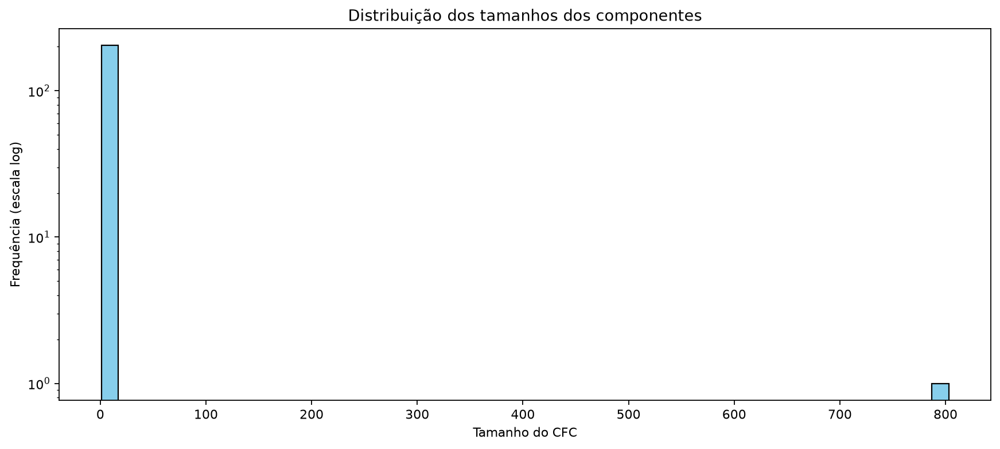
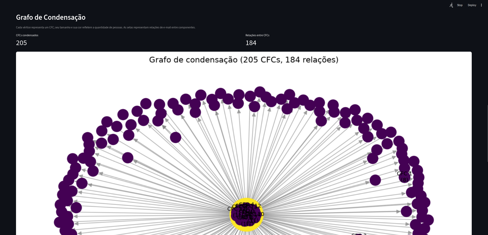
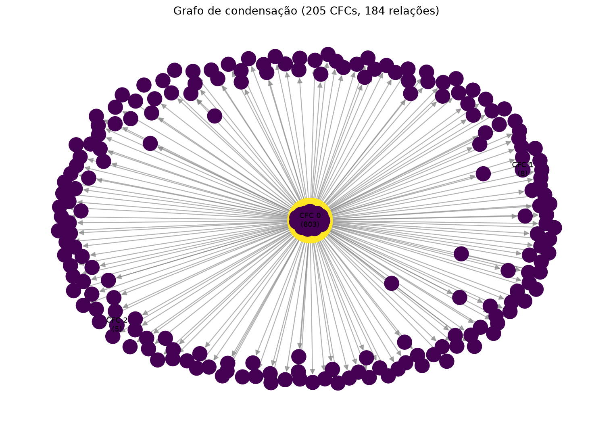
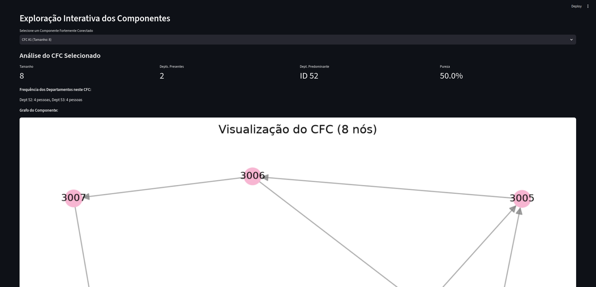
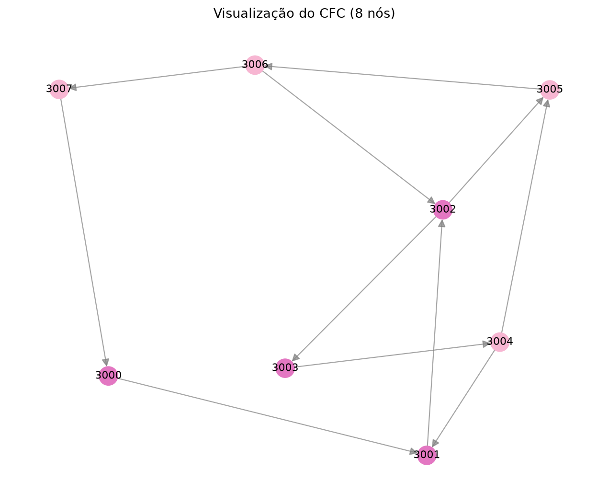

# EmailCFC

**Conteúdo da Disciplina:** Grafos

## Alunos

| Matrícula | Aluno |
| -- | -- |
| 23/1011838 | Tiago Antunes Balieiro |
| 23/1026714 | Euller Júlio da Silva |

## Apresentação do trabalho
[Link para o vídeo de apresentação](https://youtu.be/fl6da5XLF-o)

## Sobre

O projeto analisa a rede direcionada de comunicação **email-Eu-core**, publicada
pelo Stanford Network Analysis Project (SNAP). Cada pessoa é representada por um
vértice, uma aresta `u → v` indica que `u` enviou ao menos um e-mail para `v`, e
cada pessoa está associada a um departamento.

A aplicação carrega os dados, constrói uma lista de adjacência própria e encontra
os Componentes Fortemente Conectados (CFCs) com uma implementação manual do
algoritmo de Kosaraju. Em seguida, relaciona os componentes aos departamentos,
calcula tamanho, distribuição departamental, departamento predominante e pureza,
e constrói o grafo de condensação da rede.

O projeto utiliza a base pública **email-Eu-core Network**, disponibilizada pelo Stanford Network Analysis Project (SNAP). O dataset representa a rede de comunicação por e-mails de uma grande instituição de pesquisa europeia, com os dados anonimizados para preservar a identidade dos participantes. Cada pessoa da instituição é modelada como um vértice de um grafo direcionado, e uma aresta `u → v` existe quando a pessoa `u` enviou pelo menos um e-mail para a pessoa `v`. A base utilizada contém **1.005 vértices e 25.571 relações**, além de informações adicionais de comunidade, nas quais cada indivíduo está associado a exatamente um dos **42 departamentos** da instituição. Essas informações permitem analisar não apenas a estrutura da rede de comunicação, mas também investigar a relação entre os Componentes Fortemente Conectados encontrados e a organização departamental da instituição.

- Fonte dos dados: https://snap.stanford.edu/data/email-Eu-core.html

O objetivo principal deste trabalho é modelar o dataset na forma de um grafo direcionado e extrair informações valiosas a partir dele. Mais especificamente, busca-se implementar um algoritmo eficiente para mapear as interações fechadas na rede e compreender os subgrupos existentes, aplicando na prática os conceitos teóricos de grafos.

Para isso, a abordagem baseada em **Componentes Fortemente Conectados (CFC)** é justificada por permitir particionar a rede em agrupamentos (clusters) em que cada par de vértices tem um caminho mútuo. Identificar esses CFCs ajuda a entender o núcleo de relacionamentos da rede, simplificar o processamento através do grafo condensado e resolver as dependências do problema original de maneira eficiente.

Para a extração dos componentes, optou-se pela utilização do **Algoritmo de Kosaraju**. A escolha baseia-se na sua elegância e facilidade de implementação, que utiliza essencialmente duas chamadas de Busca em Profundidade (DFS): uma no grafo original para determinar a ordem de finalização dos vértices e outra no grafo transposto (reverso). O algoritmo executa em tempo linear $O(V + E)$, sendo eficiente e perfeitamente adequado para processar o dataset escolhido dentro dos requisitos de tempo e espaço computacional.

## Screenshots
A seguir estão imagens do projeto em funcionamento.


*Figura 1: Dashboard de Análise: Componentes Fortemente Conectados - Métricas Gerais e Distribuição dos tamanhos dos componentes.*


*Figura 2: Análise por Departamento.*


*Figura 3: Imagem da Distribuição dos tamanhos dos componentes.*


*Figura 4: Grafo de Condensação.*


*Figura 5: Imagem do Grafo de Condensação.*


*Figura 6: Exploração Interativa dos Componentes e Análise do CFC selecionado.*


*Figura 1: Imagem da visualização do CFC com 8 nós.*


## Instalação

**Linguagem:** Python 3.10+<br>
**Framework:** Streamlit<br>
**Bibliotecas principais:** Matplotlib, NetworkX e SciPy

Pré-requisitos:

- Python 3.10 ou superior;
- Git;
- os arquivos `email-Eu-core.txt` e
  `email-Eu-core-department-labels.txt` dentro de `data/`.

Clone o projeto e entre no diretório:

```bash
git clone https://github.com/projeto-de-algoritmos-2026/G30_Grafos_PA-26.2.git
cd G30_Grafos_PA-26.2
```

Crie e ative um ambiente virtual:

```bash
python3 -m venv .venv
source .venv/bin/activate
```

Instale as dependências e execute o dashboard:

```bash
python -m pip install -r requirements.txt
streamlit run app.py
```

O Streamlit informará o endereço local da aplicação, normalmente
`http://localhost:8501`.

Para executar os testes automatizados:

```bash
python -m pytest -q
```

## Uso

Após iniciar o dashboard:

1. Consulte a visão geral para conferir pessoas, relações, departamentos,
   quantidade de CFCs e tamanho do maior componente.
2. Em **Análise por Departamento**, selecione um departamento para ver sua
   quantidade de pessoas, os CFCs nos quais aparece, o principal componente e a
   porcentagem de membros concentrada nele.
3. Em **Grafo de Condensação**, observe cada CFC contraído em um único vértice e
   as relações direcionadas existentes entre componentes.
4. Em **Exploração Interativa dos Componentes**, selecione um CFC para consultar
   tamanho, departamentos, pureza, frequências e sua visualização interna.

Componentes grandes exigem mais tempo para o cálculo do posicionamento visual.

## Outros

### Resultados da análise

Os resultados abaixo foram reproduzidos com o carregador, a implementação de
Kosaraju e as funções de análise deste repositório. Para a análise científica foi
considerada a rede oficial, formada pelos IDs `0` a `1004`.

| Métrica | Rede oficial | Execução atual com dados de demonstração |
| -- | --: | --: |
| Pessoas | 1.005 | 1.018 |
| Relações direcionadas | 25.571 | 25.588 |
| Departamentos | 42 | 46 |
| CFCs encontrados | 203 | 205 |
| Relações no grafo de condensação | 184 | 184 |

A execução atual inclui 13 pessoas sintéticas, com IDs iniciados em `2000` e
`3000`, adicionadas exclusivamente para demonstrar CFCs pequenos na visualização.
Elas formam dois componentes desconectados da rede oficial e não alteram o CFC
principal nem as 184 relações originais do grafo de condensação.

### Tamanho dos principais componentes

Na rede oficial há um único CFC não trivial:

| Componente | Tamanho | Parcela das pessoas |
| -- | --: | --: |
| Principal | 803 | 79,90% |
| Demais 202 componentes | 1 pessoa cada | 20,10% no total |

Com os dados de demonstração, os três maiores CFCs possuem respectivamente
**803**, **8** e **5** pessoas; os outros **202** permanecem unitários. O tamanho
803 coincide com o valor de referência informado para a base email-Eu-core.

### Relação entre CFCs e departamentos

- O CFC principal reúne pessoas de **40 dos 42 departamentos**, indicando forte
  integração entre diferentes setores da instituição.
- O departamento predominante no CFC principal é o departamento **4**, com 88
  pessoas. Sua pureza é de apenas **10,96%**, portanto o maior componente não é
  dominado por um único departamento.
- Das 109 pessoas do departamento 4, **88 (80,73%)** estão no CFC principal.
- O departamento 14 possui **80 de 92 membros (86,96%)** no componente principal.
- O departamento 21 é o mais disperso: seus 61 membros aparecem em **28 CFCs**;
  34 deles, ou **55,74%**, estão no CFC principal.
- Somente os departamentos **18** e **33** não aparecem no maior CFC; cada um é
  representado por uma pessoa em um componente unitário.

### Descobertas interessantes

- A rede apresenta uma estrutura de núcleo e periferia muito marcada: quase 80%
  das pessoas pertencem ao mesmo CFC, enquanto 202 pessoas formam componentes
  unitários.
- Os componentes unitários representam **99,51% da quantidade de CFCs**, embora
  contenham apenas **20,10% das pessoas**.
- A baixa pureza departamental do núcleo mostra que conectividade mútua e divisão
  administrativa não são equivalentes: o principal grupo de comunicação é
  amplamente interdepartamental.
- Cinco departamentos — **12, 25, 37, 39 e 40** — possuem todos os seus membros
  dentro do CFC principal, embora sejam departamentos relativamente pequenos.
- O grafo de condensação reduz a rede oficial de 1.005 pessoas e 25.571 relações
  para **203 vértices e 184 relações**, facilitando a observação do fluxo entre o
  núcleo e os componentes periféricos.
